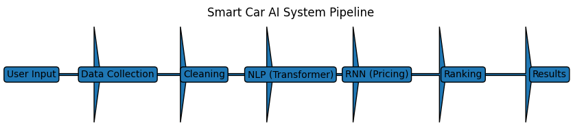
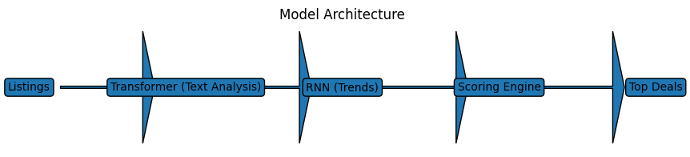
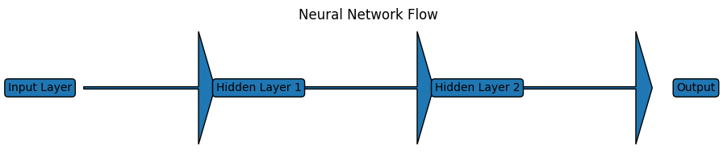

# Erwin_Cheng_AI_Portfolio_DL
# 👋 Erwin Cheng – AI Portfolio

---

## 🚀 About This Portfolio

This repository showcases my work in **Artificial Intelligence (ITAI 2376)**, where I built hands-on projects and explored how AI systems work in real-world scenarios.

Instead of just learning theory, I focused on:

* Building AI models
* Understanding how data affects predictions
* Creating a real-world AI application

---

## 🧠 Skills

* Python & Jupyter Notebooks
* Machine Learning & Deep Learning
* Neural Networks (RNN, LSTM, Transformers)
* NLP (Natural Language Processing)
* Data Preprocessing & Analysis
* Streamlit App Development

---

## 💼 Featured Project

## 🚗 Smart Car Buying Assistant

### ❗ Problem

Buying a car online is time-consuming and confusing:

* Listings are spread across multiple platforms
* Prices are inconsistent
* Hard to identify good deals

### ✅ Solution

An AI-powered assistant that:

* Aggregates car listings
* Uses NLP to analyze descriptions
* Uses RNN to analyze pricing trends
* Ranks the best deals

---

## 🧠 Model Design

* **Transformer (NLP)** → Understands listing descriptions
* **RNN (Time Series)** → Tracks pricing trends
* **Ranking Engine** → Recommends best deals

---

## 🎥 Demo

👉 Live App: https://erwinchengsoloitai2376-k9u7xjwauuu5nnkm22fzkf.streamlit.app/

---

## ⚙️ Technical Highlights

* Built an AI agent using a structured pipeline
* Combined NLP + time-series models
* Implemented data cleaning for real-world data
* Designed ranking logic for decision-making

---

## 📂 Projects

### 🧠 Neural Network Zoo

* RNN vs LSTM comparison
* Shows how AI handles sequential data
  👉 `projects/neural-network-zoo`

---

### ⚙️ TensorFlow vs PyTorch

* Framework comparison
* When to use each
  👉 `projects/tensorflow-vs-pytorch`

---

### 🤖 AI Decision Concepts

* Weights, bias, activation explained
  👉 `projects/ai-decision-concepts`

---

## 🧪 Labs

Hands-on work with pre-trained models and predictions
👉 `labs/`

---

## 🧩 Neural Network Basics

Neural networks learn patterns by adjusting weights and passing data through layers.

---

## 🎯 Key Takeaway

AI isn’t just about models—it’s about **clean data, smart design, and real-world usability**.

---

## 📬 Contact

* GitHub: https://github.com/cwin3
* Email: egr.cheng@gmail.com

---

## 🔑 Keywords

Machine Learning, AI Agent, NLP, Transformers, RNN, Python, Streamlit
